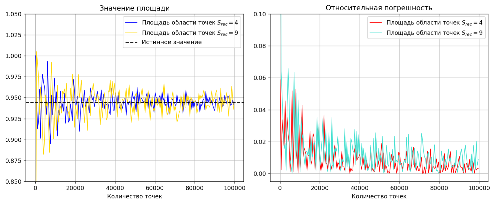

Реализованный алгоритм Монте-Карло поиска площади фигуры для задачи __A1i__ реализован в файле `a1i.cpp` и прошел тесты на codeforces с номером посылки `292304214`.

В файле `a1.cpp` алгоритм Монте-Карло реализован для площади заданной условием фигуры и запускается отдельно для каждого значения числа точек от 100 до 100000 с шагом 500. Эксперемент проводится для двух разных областей $S_{rec}$ , где могут находится точки: меньшая с площадью 4 и большая с площадью 9.  На каждом запуске таже вычисляется отностительная погрешность вычисленного значения в сравнении с наиболее близким к истинному значением, вычисленном по формуле:

$$
0.25 \cdot \pi + 1.25 \cdot \arcsin{0.8} − 1 \approx 0.9445171858994637
$$

Результаты эксперимента сохраняются в файл `data.csv`, по которому скрипт `graphs.py` строит графики:

По ним можно увидеть, что, несмотря на довольно сильные колебания, с увеличением числа точек вычисленное значение площади стремится к истинному значению, а отнсительная погрешность уменьшается. Также можно наблюдать что для эксперемента с меньшей областью точек значения вычисляются точнее, что особенно видно на графике относительной погрешности
